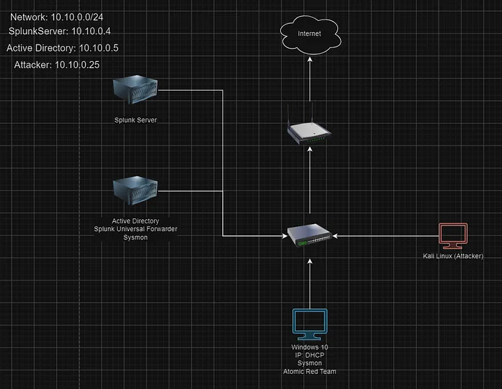
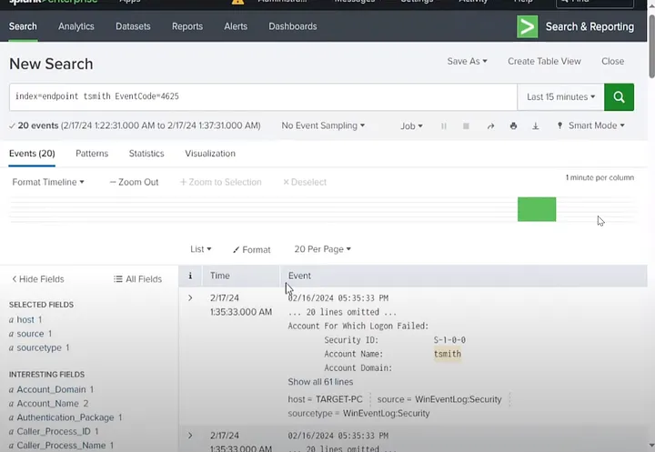
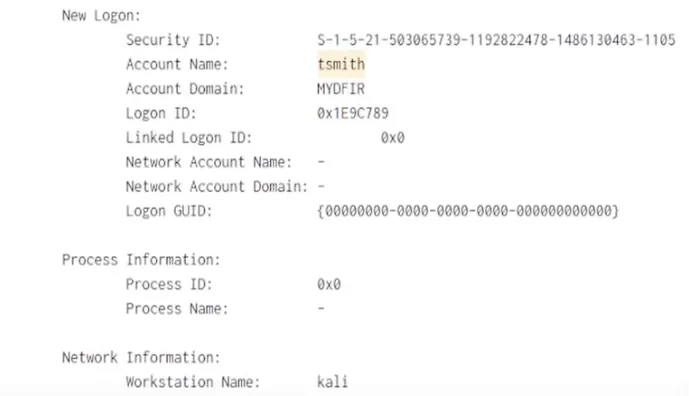
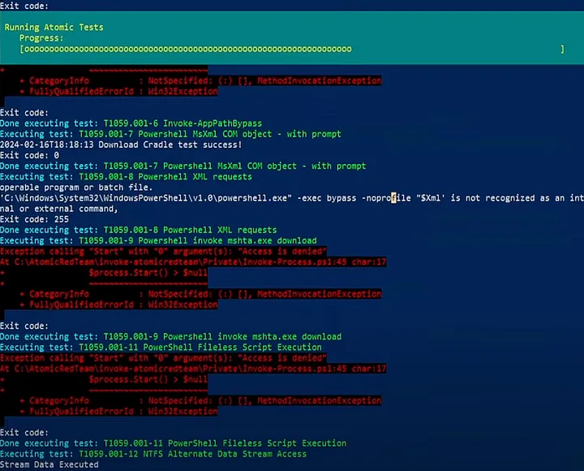
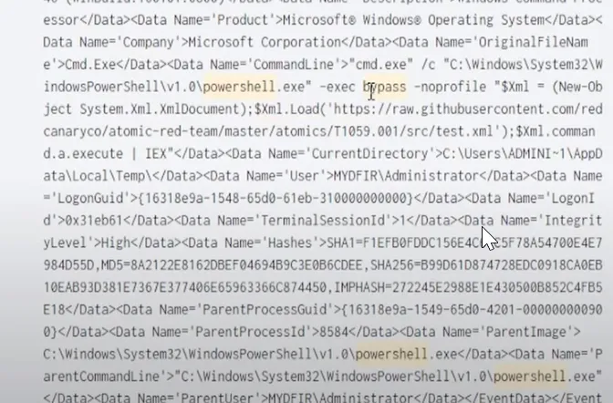
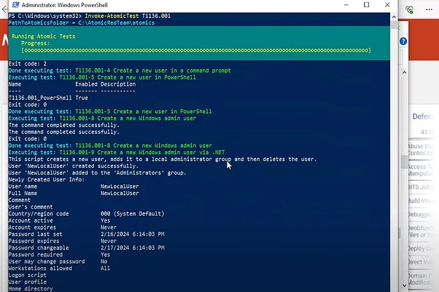
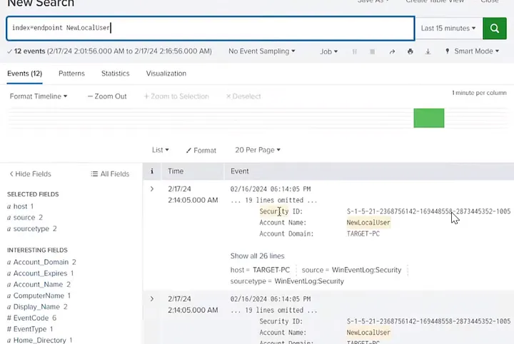

# Project Overview

This project is heavily inspired by a YouTube series on the same topic by myDFIR. Gaining hands-on experience with Active Directory (AD) and building a home lab is essential for IT professionals. A home lab offers a safe environment to experiment with key directory services, enhancing skills in areas like network administration, user management, security protocols, and group policies. It also provides a space to troubleshoot and solve problems without risking production environments. Simulating real-world scenarios, such as user authentication and access control, delivers invaluable insights. Building this foundation is crucial for anyone pursuing careers in IT, network administration, or cybersecurity.

During this project, I engaged in both red team activities (attacking the AD environment to learn about attack techniques) and blue team activities (detecting and creating alerts with Splunk).

One key takeaway from MyDFIR’s approach is the emphasis on keeping diagrams simple and focused. The goal is to convey the key systems and processes clearly, without unnecessary complexity. MyDFIR recommended using the free web tool, Draw.IO, for diagram creation, which I found to be a great choice for beginners. I'm glad I spent the time on Day 1 to plan and map out the lab architecture. This high-level visual reference will be invaluable as I configure the various tools and technologies in the following days.

---

## Setting Up the Home Lab

### Infrastructure Requirements:

- **Virtualization Platform:** Use platforms like VirtualBox or VMware Workstation to host the lab.
- **Hardware:** 16GB RAM, 250GB disk space.

### Components and Tools:

- **Windows 10:** Target machine.
- **Sysmon:** Used for logging.
- **Windows Server 2022:** Active Directory server.
- **Kali Linux & Atomic Red Team:** Tools for performing brute force attacks and running "atomic tests" simulating adversarial techniques.
- **Splunk:** For creating alerts, reports, and dashboards.

---

## Work Overview

1. **Attack Simulation:**
   - Enabled RDP on the target machine.
   - Performed a brute-force attack on RDP using the Crowbar tool and the popular wordlist, Rockyou.
   
2. **Detection with Splunk:**
   - Investigated failed login attempts for a specific user account (T. Smith) by filtering events for login failures (Event ID: 4625). Identified 20 failed attempts in 15 minutes.
   - Analyzed login events and found a successful login (Event ID: 4624) from the Kali machine.

   
   

3. **Atomic Red Team Tests:**
   - Installed Atomic Red Team on the target machine to test tactics like T1059 (Command Line Interface) and T1136 (Create Account) from the MITRE ATT&CK framework.
   - Searched Splunk for related events to monitor and verify the tests.

   
   
   
   

---

## Conclusion

This project was an exciting opportunity to gain practical experience with Active Directory. Setting up Group Policy Objects, managing permissions, and configuring various AD settings gave me a deep understanding of AD administration. Overall, working on this home lab significantly strengthened my grasp on both red and blue team operations.

